# 📖 MOVIELOG — 영화를 읽다

> *"책은 영화를 그리게 합니다."*

---

## 📚 브랜드 아이덴티티

**MOVIELOG**는 **'책 속의 영화'** 라는 컨셉에서 출발합니다.

'책'은 역사적 기록과 사건, 사회시사와 풍자, 전문적 지식, 판타지 소설 등을 **인쇄매체**로 전달합니다.
'영화'는 같은 내용을 **영상매체**로 접하는 것일 뿐, 사람들이 취하는 정보는 동일합니다.

책은 청각적·시공간적 정보를 담지 못하는 한계를 지니고 있기에, 독자의 상상력을 통해 오감정보를 느끼도록 진입한다는 점에서 **'책 속의 영화'** 라는 컨셉을 기획했습니다.
영화감상은 다양한 기록을 눈으로 관찰하는 것과 같습니다.

### 🎨 디자인 언어

| 요소 | 내용 |
|------|------|
| 컬러 팔레트 | 딥 퍼플(`#2d1b4e`), 앰버 골드(`#b8860b`), 크림 베이지(`#f5f0e8`) |
| 분위기 | 고풍스러운 도서관, 촛불이 켜진 독서실, 책 페이지의 질감 |
| 레이아웃 | 메인 페이지를 **펼쳐진 책** 형태로 구성 — 좌·우 페이지에 영화 카드 배치 |
| 타이포그래피 | 세리프 계열 서체로 고전적·문학적 인상 강조 |
| UI 톤 | 과도한 화려함 없이 절제된 럭셔리, 프리미엄 감성 |

### ⭐ 타사 대비 차별점

> 기존 영화 예매 사이트들은 이미 많지만, 남녀노소 활용하기엔 직관적이지 않은 구조와 복잡한 절차가 많습니다.
> MOVIELOG는 **단순하고 직관적인 구조** 에 **감성적인 브랜드 아이덴티티** 를 더해 설계했습니다.

- **직관적이고 빠른 예매 시스템** — 단순한 구조와 디자인으로 남녀노소 빠르고 간편하게 예매
- **더욱 편리한 관리자 시스템** — 관리자 또한 사용자이므로, 영화 등록·삭제·수정을 직관적이고 효율적으로 구성
- **VIP LOUNGE 채팅 시스템** — 예매 포인트로 개별 등급을 설정하고 500P 이상(예매 50석 이상)부터 VIP간 영화 평론을 주고받을 수 있는 커뮤니케이션 공간. 제한된 공간에 대한 호기심을 유발해 예매를 유도하는 마케팅 효과도 겸비

---

## 📝 소개

**MOVIELOG**는 영화 예매, 회원 관리, VIP 라운지 채팅, 관리자 대시보드를 갖춘 풀스택 웹 애플리케이션입니다.

---

## 📋 목차

- [브랜드 아이덴티티](#-브랜드-아이덴티티)
- [소개](#-소개)
- [UI 소개](#-ui-소개)
- [주요 기능](#-주요-기능)
- [기술 스택](#-기술-스택)
- [프로젝트 구조](#-프로젝트-구조)
- [API 주요 엔드포인트](#-api-주요-엔드포인트)
- [실행 방법](#-실행-방법)
- [팀 자체평가](#-팀-자체평가)
- [개선할 점](#-개선할-점)

---

## 🖼️ UI 소개

<table>
  <tr>
    <td align="center">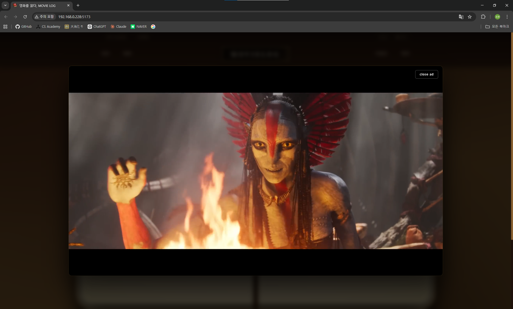<br/>광고 모달</td>
    <td align="center">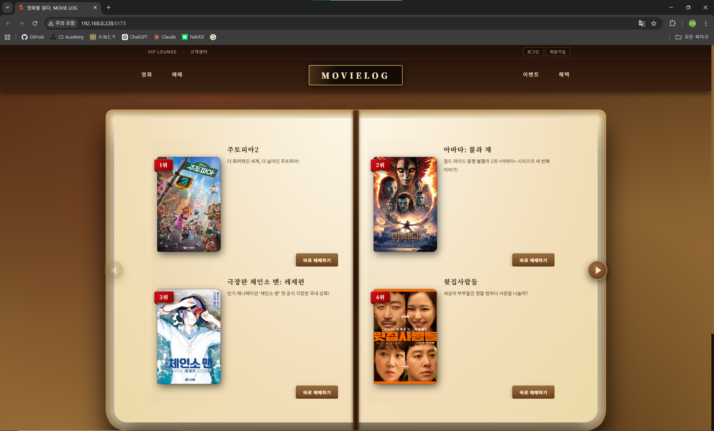<br/>메인 페이지</td>
    <td align="center">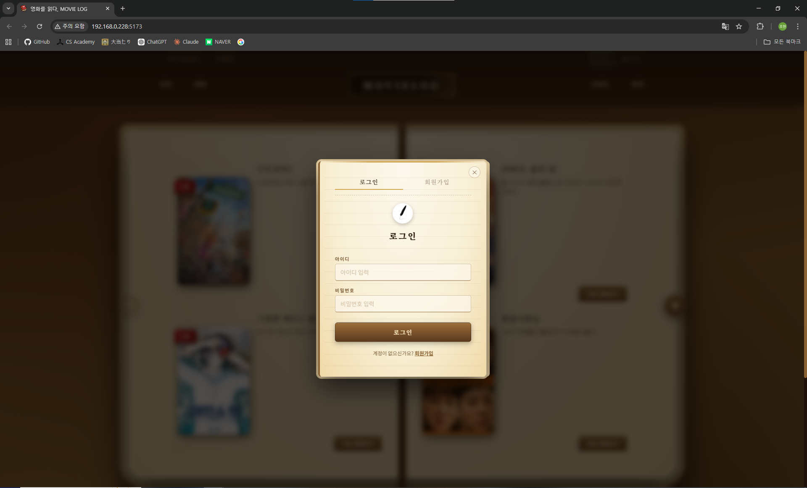<br/>로그인</td>
    <td align="center">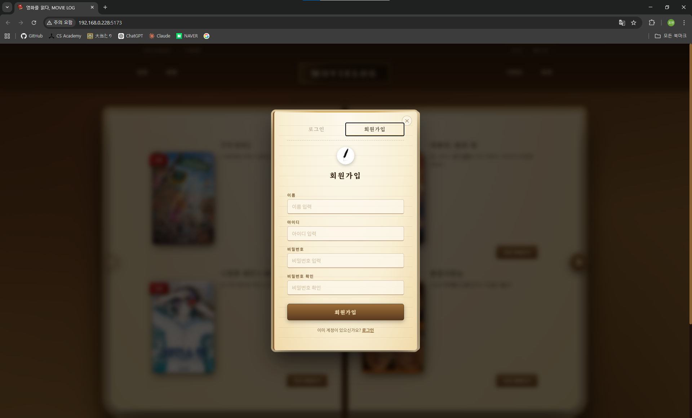<br/>회원가입</td>
  </tr>
  <tr>
    <td align="center">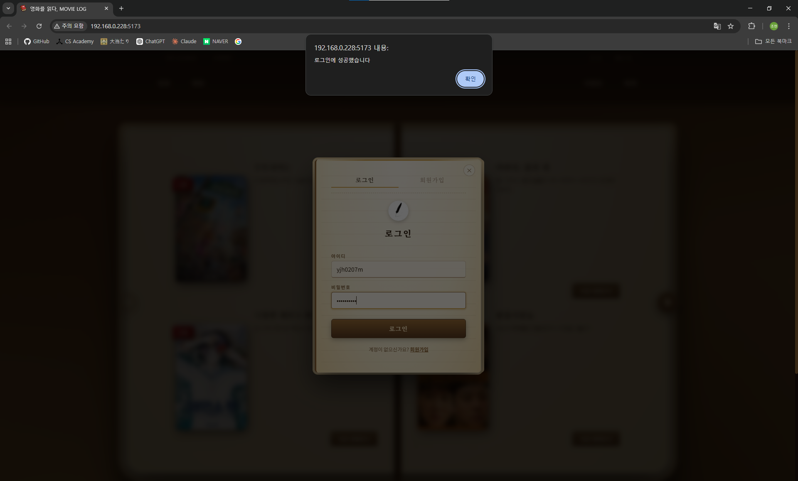<br/>로그인 성공</td>
    <td align="center">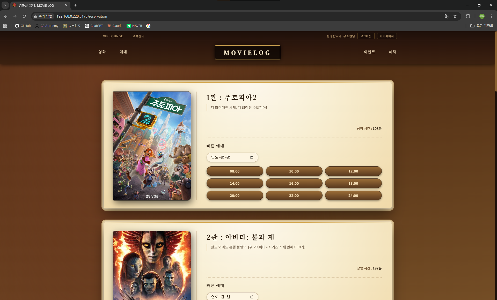<br/>예매 — 상영 일정 선택</td>
    <td align="center">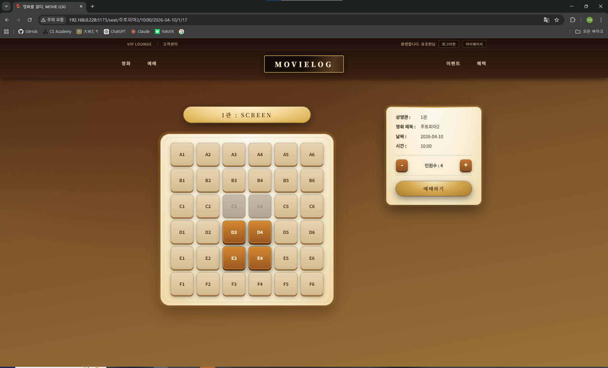<br/>좌석 선택</td>
    <td align="center">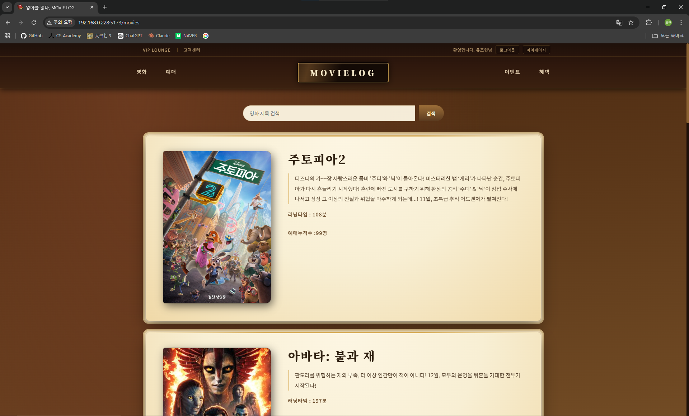<br/>영화 목록</td>
  </tr>
  <tr>
    <td align="center">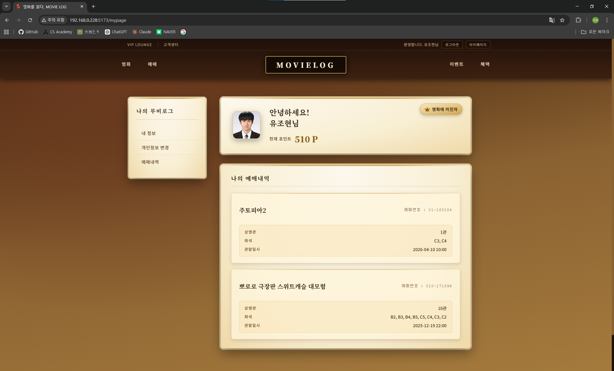<br/>마이페이지</td>
    <td align="center">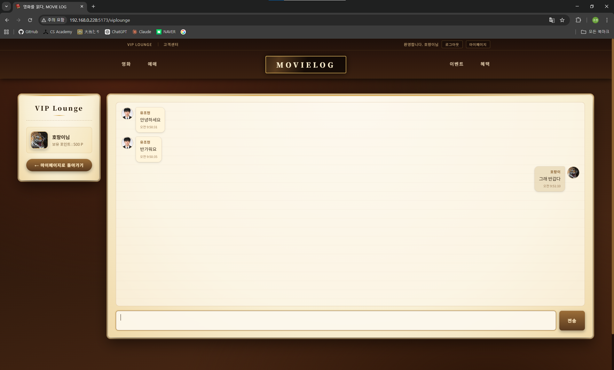<br/>VIP 라운지</td>
    <td align="center">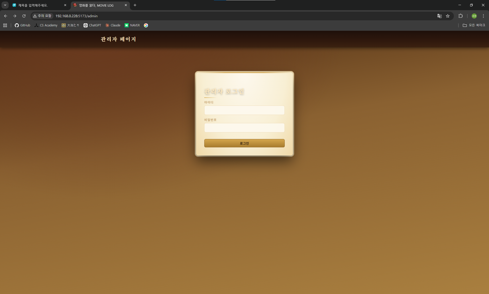<br/>관리자 로그인</td>
    <td align="center">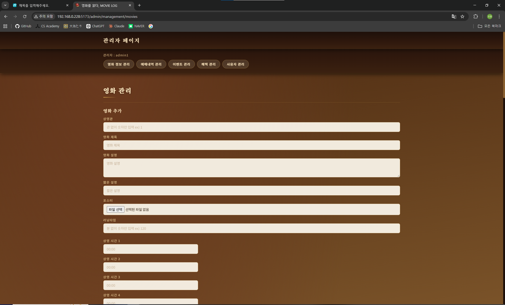<br/>영화 관리 (1)</td>
  </tr>
  <tr>
    <td align="center">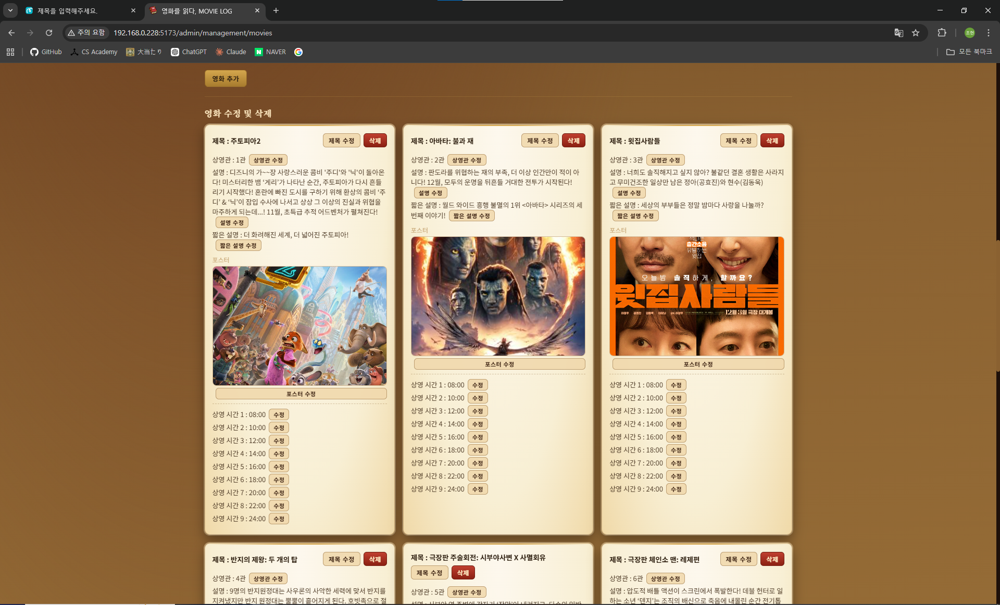<br/>영화 관리 (2)</td>
    <td align="center">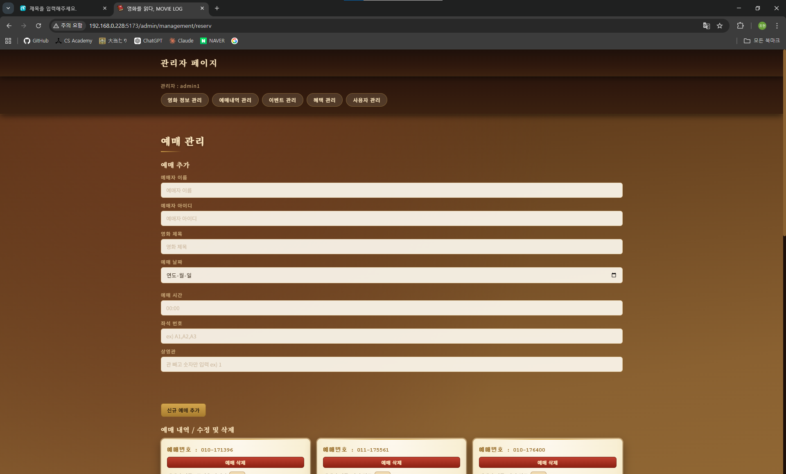<br/>예매 관리 (1)</td>
    <td align="center">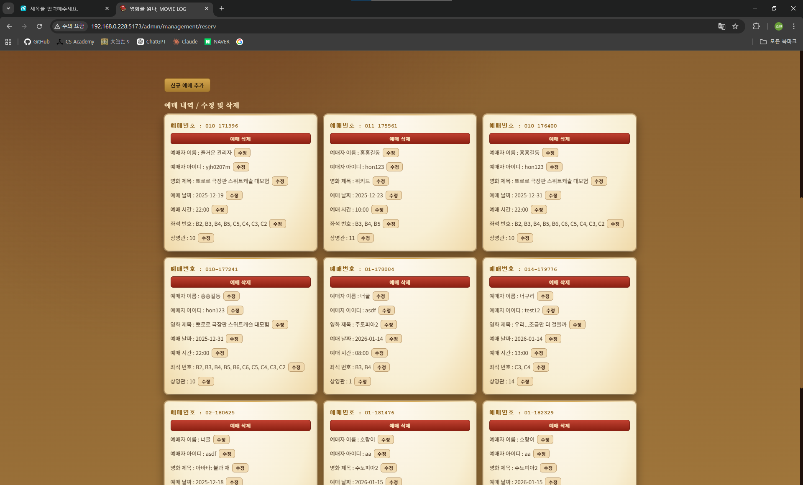<br/>예매 관리 (2)</td>
    <td align="center">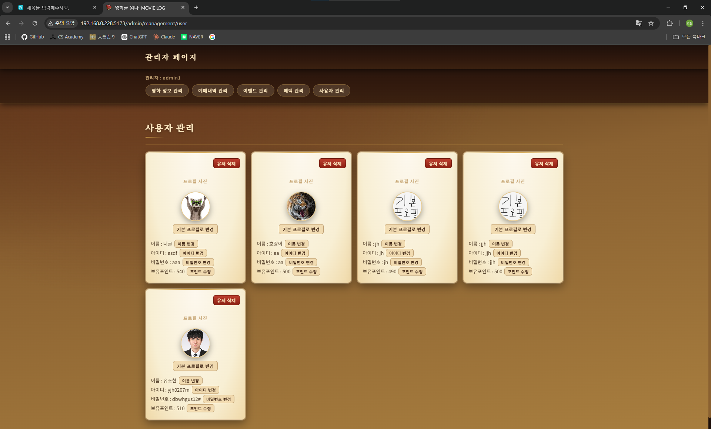<br/>회원 관리</td>
  </tr>
</table>

---

## ✨ 주요 기능

| 기능 | 설명 |
|------|------|
| 회원가입 / 로그인 | 헤더 모달(`AuthModal`) 또는 전용 페이지(`/login`, `/join`)에서 가능. 아이디 중복 검사, 비밀번호 확인 포함 |
| 영화 목록 | 전체 영화 조회 및 제목 검색(스크롤 이동), 누적 예매수 표시 |
| 영화 예매 | 상영관·날짜·시간 선택 (영화당 최대 9개 시간대). 메인에서 바로 예매하기 지원 |
| 좌석 선택 | A~F열 × 1~6번, 총 36석. 인원수 선택 후 다중 좌석 선택, 이미 예매된 좌석 실시간 표시 |
| 결제 | 등록된 카드 선택 후 결제. 좌석 1개당 10,000원 / 10P 적립 |
| 마이페이지 | 예매 내역 조회, 포인트·등급 확인, 프로필 사진 변경 (클릭 즉시 업로드) |
| 등급 시스템 | 포인트 기준 4단계: 영화 입문자(1P~) / 영화 중수(100P~) / 영화에 미친자(500P~) / 영화 그 자체(1000P~). 회원가입 초기 포인트 490P |
| 카드 관리 | 카드 등록(번호·유효기간·카드사·별명), 별명 수정, 삭제 |
| VIP 라운지 | WebSocket 기반 실시간 채팅 (500P 이상 이용 가능). 이미지 URL 자동 렌더링, 프로필 확대 보기 지원 |
| 이벤트 / 혜택 | 포스터 이미지 목록 조회 |
| 관리자 페이지 | 영화(상영시간 9개·포스터·정보) / 예매 / 회원 / 이벤트 / 혜택 CRUD 관리 |

---

## 🛠️ 기술 스택

### Frontend
- **React 19** (`^19.2.0`) + **Vite 7** (`^7.2.4`)
- React Router DOM 7 (`^7.9.6`) — SPA 라우팅
- react-icons `^5.5.0` — 마이페이지 등급 왕관 아이콘 등

### Backend
- **Node.js** + **Express 5** (`^5.2.1`)
- **MariaDB** (`^3.4.5`, mariadb 드라이버)
- **multer** `^2.0.2` — 파일 업로드 (포스터, 프로필, 이벤트/혜택 이미지)
- **ws** `^8.18.3` — WebSocket 서버 (VIP 라운지 채팅)
- **nodemon** `^3.1.14` — 개발 서버 자동 재시작
- **dotenv** `^17.2.3` — 환경변수 관리

---

## 📁 프로젝트 구조

```
MovieLog/
├── back/                       # 백엔드 (Express)
│   ├── index.js                # REST API 서버 (포트 3000)
│   ├── db.js                   # MariaDB 연결 풀
│   ├── server/
│   │   └── wsServer.js         # WebSocket 서버 (포트 3001)
│   ├── upload/                 # 업로드 파일 저장소
│   │   ├── poster/             # 영화 포스터
│   │   ├── profile/            # 사용자 프로필 사진
│   │   ├── event/              # 이벤트 포스터
│   │   ├── benefit/            # 혜택 포스터
│   │   └── video/              # 예고편 영상
│   └── .env                    # DB 접속 정보
│
├── front/                      # 프론트엔드 (React + Vite)
│   └── src/
│       ├── App.jsx             # 라우터 설정
│       ├── api.js              # API 베이스 URL (LAN / WAN 자동 감지)
│       ├── Main/               # 메인 페이지, VIP 라운지, 서비스 안내
│       ├── components/         # 예매, 좌석, 결제, 영화, 이벤트, 혜택, 로그인, 회원가입, AuthModal
│       ├── mypage/             # 마이페이지, 개인정보 변경, 예매 내역
│       ├── Admin/              # 관리자 로그인 및 관리 메뉴 (영화·예매·회원·이벤트·혜택)
│       └── css/                # 컴포넌트별 스타일시트
│
├── screen_shot/                # UI 스크린샷
└── MovieLog_dump.sql           # DB 덤프 파일
```

---

## 🔌 API 주요 엔드포인트

> **Base URL** — 내부망: `http://192.168.0.228:3000` / 외부망: `http://112.218.47.101:3000`  
> `front/src/api.js` 에서 접속 호스트에 따라 자동 전환됩니다.  
> ⚠️ 별도의 `/login` 엔드포인트는 없으며, 로그인 검증은 클라이언트가 `/userinfo` 전체를 받아 처리합니다.

### 사용자

| Method | 경로 | 설명 |
|--------|------|------|
| GET | `/userinfo` | 전체 유저 목록 (로그인·중복검사에 사용) |
| POST | `/join` | 회원가입 (초기 포인트 490P) |
| PUT | `/changePassword` | 비밀번호 변경 |
| PUT | `/changeName` | 이름 변경 |
| GET | `/userprofile/:id` | 프로필 사진 경로 조회 |
| PUT | `/updateProfile` | 프로필 사진 변경 (multipart) |

### 영화

| Method | 경로 | 설명 |
|--------|------|------|
| GET | `/movies` | 전체 영화 목록 (상영관 번호 오름차순) |
| GET | `/movieinfo` | 영화 목록 (예매누적 내림차순, 메인 랭킹용) |

### 예매

| Method | 경로 | 설명 |
|--------|------|------|
| POST | `/reserv` | 좌석 예매 |
| GET | `/seatlist` | 전체 예매 내역 (좌석 점유 확인용) |
| GET | `/seatlist/:id` | 나의 예매 내역 (최신순) |
| PUT | `/reservcount` | 영화 누적 예매수 증가 |

### 포인트 / 카드

| Method | 경로 | 설명 |
|--------|------|------|
| GET | `/point/:id` | 포인트 조회 |
| PUT | `/point/add/:id` | 포인트 적립 (좌석수 × 10P) |
| GET | `/cardinfo/:id` | 유저 카드 목록 조회 |
| POST | `/newcard` | 카드 등록 |
| DELETE | `/carddelete` | 카드 삭제 |
| PUT | `/cardnameupdate` | 카드 별명 수정 |

### 이벤트 / 혜택

| Method | 경로 | 설명 |
|--------|------|------|
| GET | `/eventinfo` | 이벤트 목록 |
| GET | `/benefitinfo` | 혜택 목록 |

### 관리자

| Method | 경로 | 설명 |
|--------|------|------|
| GET | `/admin` | 관리자 계정 정보 조회 |
| POST | `/movies/add` | 영화 추가 (포스터 포함 multipart) |
| PUT | `/movies/update` | 영화 필드 수정 |
| PUT | `/movies/updateposter` | 영화 포스터 교체 |
| DELETE | `/movies/delete` | 영화 삭제 |
| POST | `/seat/add` | 예매 추가 |
| PUT | `/seat/update` | 예매 필드 수정 |
| DELETE | `/seat/delete` | 예매 삭제 |
| POST | `/event/add` | 이벤트 포스터 추가 (다중 파일) |
| DELETE | `/event/delete` | 이벤트 포스터 삭제 |
| POST | `/benefit/add` | 혜택 포스터 추가 (다중 파일) |
| DELETE | `/benefit/delete` | 혜택 포스터 삭제 |
| DELETE | `/deleteuser` | 유저 삭제 |
| PUT | `/userupdate` | 유저 필드 수정 |
| PUT | `/admin/updateprofile` | 유저 프로필 사진 변경 |
| PUT | `/setdefaultprofile` | 유저 프로필 기본 사진으로 초기화 |

---

## 🚀 실행 방법

### ⚙️ 사전 준비
- Node.js 설치
- MariaDB 설치 및 DB 생성 (`team2`)
- DB 덤프 파일 임포트: `MovieLog_dump.sql`

### 🖥️ 백엔드 실행
```bash
cd back
npm install
# .env 파일에 DB 접속 정보 입력
npm run a                    # nodemon index.js (포트 3000)
node server/wsServer.js      # WebSocket 서버 (포트 3001)
```

### 🌐 프론트엔드 실행
```bash
cd front
npm install
npm run dev        # Vite 개발 서버 (--host 옵션으로 LAN 공유 가능)
```

### 🔧 환경변수 설정 (`back/.env`)
```
DB_HOST=<MariaDB 호스트>
DB_USER=<DB 사용자>
DB_PASS=<DB 비밀번호>
DB_NAME=team2
```

---

## 💬 팀 자체평가

### 팀장 : 김찬

이번 프로젝트를 통해 프론트엔드, 백엔드, 데이터베이스가 서로 어떻게 연결되어 동작하는지 이해할 수 있었습니다. 직접 사용자, 예매, 영화 등의 정보를 관리하게 되면서 DB 테이블은 어떻게 구성해야 하고, 어떻게 관리해야 하는지도 알 수 있었고, 특히 데이터 전달 과정에서 발생한 오류를 해결하며 디버깅의 중요성과 문제 해결 능력을 기를 수 있었습니다. 책과 영화라는 아이디어를 활용하면서 참신한 아이디어로 프로젝트를 만들게 된 것이 이번 프로젝트에게 가장 큰 성과인 것 같습니다.

### 팀원 : 유조현

기존의 영화 예매 페이지는 이미 많지만 남녀노소 활용하기엔 직관적이지 않은 구조와 디자인, 복잡한 절차가 많습니다. 때문에 저희 'MOVIELOG'는 남녀노소 활용할 수 있도록 직관적이고 단순한 구조로 설계하였습니다. '책 속의 영화'라는 의미 깊고 감성적인 기획으로서 타 영화 예매처 대비 경쟁력을 갖추고, VIP 전용 채팅 시스템을 통해 사용자들에게 프라이빗한 공간의 커뮤니케이션을 제공하여 영화를 좋아하는 사람들에게 특수한 유대감을 형성하고 제한된 공간에 대한 호기심을 유발하여 VIP가 되기 위해 예매를 유도하는 마케팅적 효과도 지니고 있습니다.

---

## 📱 APP 버전

https://github.com/PigDuck5390/MovieLogApp

---

## 🔮 향후 개선 계획

이 프로젝트를 진행하며 풀스택 개발의 전체 흐름을 직접 경험했고, 그 과정에서 다음 단계로 발전시켜야 할 부분들을 스스로 발견했습니다. 아래는 이 프로젝트를 통해 배운 개선 방향과 다음 프로젝트에서 적용할 계획입니다.

### 1. 서버 측 로그인 및 비밀번호 해싱

현재는 학습 목적으로 클라이언트가 `/userinfo` 전체를 받아와 로그인을 처리하는 구조로 구현했습니다. 이 과정에서 서버 측 인증과 비밀번호 해싱의 필요성을 직접 체감했습니다.

**계획**: 서버에 `/login` 엔드포인트를 추가하고, `bcrypt`로 비밀번호를 해싱하여 저장·비교하는 방식으로 전환합니다.

```js
const bcrypt = require('bcrypt');
app.post('/login', async (req, res) => {
  const [user] = await pool.query('SELECT * FROM user WHERE id = ?', [req.body.id]);
  if (!user || !(await bcrypt.compare(req.body.pw, user.pw))) {
    return res.status(401).json({ error: '계정 정보가 없습니다' });
  }
  res.json({ name: user.name, id: user.id });
});
```

---

### 2. SQL 화이트리스트 검증

관리자 API에서 동적 필드 수정을 간결하게 구현하다 보니 필드명을 쿼리에 직접 삽입하는 구조가 됐습니다. 이 프로젝트를 통해 SQL 인젝션의 발생 원리를 명확히 이해했고, 화이트리스트 검증이 표준 해결책임을 배웠습니다.

**계획**: 수정 가능한 필드명을 서버에서 사전 정의된 목록으로 검증한 뒤 쿼리를 실행합니다.

```js
const ALLOWED_MOVIE_FIELDS = ['title', 'description', 'short_description', 'runtime',
  'screen_number', 'start_time1', 'start_time2', 'start_time3', 'start_time4',
  'start_time5', 'start_time6', 'start_time7', 'start_time8', 'start_time9'];
if (!ALLOWED_MOVIE_FIELDS.includes(req.body.field)) {
  return res.status(400).json({ error: 'Invalid field' });
}
```

---

### 3. JWT 기반 인증 및 상태 영속성

현재 로그인 상태를 React Router의 `location.state`로 관리하다 보니 새로고침 시 초기화되는 UX 문제가 있습니다. 이를 통해 토큰 기반 인증과 클라이언트 상태 관리의 중요성을 배웠습니다.

**계획**: JWT를 도입해 서버에서 토큰을 발급하고, `localStorage` 또는 `httpOnly 쿠키`에 저장해 새로고침 후에도 로그인이 유지되도록 개선합니다.

```js
function authMiddleware(req, res, next) {
  const token = req.headers.authorization?.split(' ')[1];
  if (!token) return res.status(401).json({ error: 'Unauthorized' });
  try {
    req.user = jwt.verify(token, process.env.JWT_SECRET);
    next();
  } catch {
    res.status(401).json({ error: 'Invalid token' });
  }
}
```
